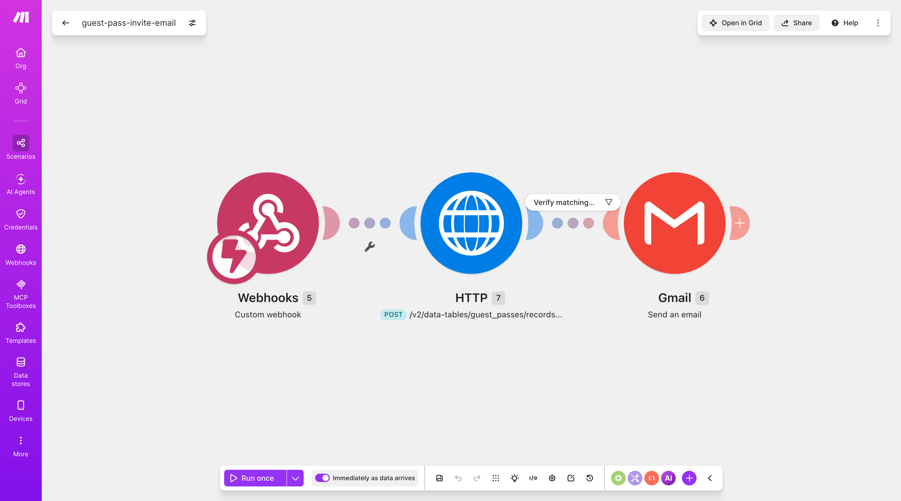
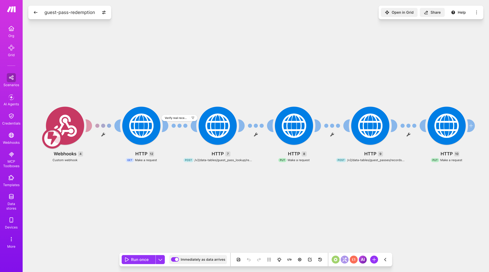
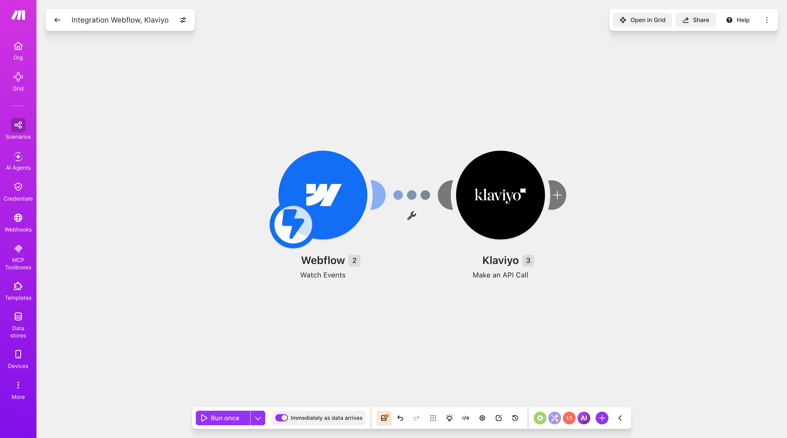

# Make.com scenarios (guest pass)

Companion to [guest-pass-referral.md](guest-pass-referral.md). Two Make.com scenarios back the two webhook URLs hardcoded in `js/ms-scripts/guest-pass.js`. Scenario screenshots: `screenshots/`.

## guest-pass-invite-email

Backs `INVITE_WEBHOOK_URL`. Fired by `postInvite()` when a member submits the email-invite form on the referral page.

**Modules:** Webhooks (Custom webhook) → HTTP `POST /v2/data-tables/guest_passes/records...` → filter "Verify matching sent pass" → Gmail (Send an email)

**Status: confirmed working end-to-end (2026-08-11)** — live-tested through the actual `/guest-pass` page, invite email received.

- Receives `{ token, recipientEmail, link }` from the client.
- Looks up the `guest_passes` record by `token` via the Memberstack Admin API (the HTTP module, `query.findMany` — `findFirst`/`findUnique` aren't usable here: `findUnique` only accepts `where.id`, not `token`, and `findFirst` isn't supported by this endpoint at all, so the response is always an array, even for a token that matches exactly one row).
- The filter ("Verify matching sent pass") gates the Gmail send on the looked-up record's own stored `recipient_email` (and `status: sent`) matching what the client sent — this is the server-side check the code comment in `guest-pass.js` calls out as required: without it, this webhook would be an open, unauthenticated relay letting anyone email arbitrary content to arbitrary addresses using the site's Gmail identity.
- Gmail module sends the actual invite email using the record's own looked-up data (recipient + token for the claim link), not the raw request body.

#### Debugging note: mapping a field out of `records[]`

This scenario shipped broken (invite emails silently never sent) for a while — not from a code bug, but from how the array item's fields were mapped inside Make. Worth documenting since it's a sharp edge in Make itself, not this codebase:

- The HTTP module's response is `Data.data.records[]`, each item shaped `{ id, internalOrder, createdAt, updatedAt, data: { recipient_email, status, token, ... } }` — the actual fields sit one level deeper, under a nested `data` key, same shape the client SDK returns (`record.data.recipient_email`).
- **Hand-typing a path like `records[1].data.recipient_email`** into a mapped field renders as a clean, valid-looking merged chip in the editor — but silently resolves to nothing at runtime. Comparing it (even to an identical hardcoded literal) always fails, and feeding it to a field that validates format (Gmail's "To") throws `Invalid email address`.
- **Adding a Flow Control → Iterator module** to walk the array, then referencing its `[bundle]` chip + `.data.recipient_email` typed after it, has the same problem in a different shape: `[bundle]` serializes the *entire* record object to a JSON string, and anything typed after it is dropped — confirmed by putting that exact reference in a plain-text field (Gmail Subject) and reading the raw delivered value, which came back as the whole stringified record, not the field.
- **What actually works:** map the field straight from the picker after the module has executed at least once with real data. Once `records[]` has a live sample, the picker offers each item's nested fields as individually clickable leaves (`records[] → data → recipient_email`, `→ token`, `→ status`) — inserting one of these produces a two-part reference (an array chip + a `]: data.recipient_email`-style field chip) that Make generates itself, rather than a hand-typed path. This is the only form that resolved correctly when checked directly (via a plain-text field showing the real value, not just a filter pass/fail). No Iterator needed — HTTP module 7's own array is enough once mapped this way.
- Separately, and unrelated to any of the above: the scenario's Gmail connection needed reconnecting with Gmail send scope granted (`[403] insufficient authentication scopes`) — a Google OAuth permission issue on the connection, not a mapping problem.

## guest-pass-redemption

Backs `REDEMPTION_WEBHOOK_URL`. Fired by `postRedemption()` on the `/redeem-trial` page after `watchForSignupSuccess()` detects a logged-out → logged-in transition for a valid, non-expired token.

**Modules:** Webhooks (Custom webhook) → HTTP GET → HTTP `POST /v2/data-tables/guest_pass_lookup/records...` (filter "Verify real rece...") → HTTP PUT → HTTP `POST /v2/data-tables/guest_passes/records...` → HTTP PUT

- Receives `{ token, newMemberId }`.
- Chain looks up the record in `guest_pass_lookup` by token, verifies it (filter), then PUTs `status: redeemed` there; separately looks up the matching `guest_passes` record and PUTs `status: redeemed` + `redeemed_by: newMemberId` there too.
- Both writes go through the Memberstack **Admin** API (these are direct HTTP calls with an admin key, not the client SDK) — this is Decision #7 from `docs/guest-pass-design.md`: the client SDK can't flip another member's/record's protected fields, so the status-redeemed write has to happen server-side in Make.
- Two separate tables get updated because `guest_passes` (owner-readable, has PII) and `guest_pass_lookup` (public-readable, no PII) are kept in sync but are two different rows/tables — see the schema note in [guest-pass-referral.md](guest-pass-referral.md).

## Integration Webflow, Klaviyo

**Modules:** Webflow (Watch Events) → Klaviyo (Make an API Call)

Not part of the guest-pass feature — a separate, older integration (last edited 2026-07-20) syncing Webflow events into Klaviyo. Not referenced anywhere in this repo's JS, so it's presumably driven entirely by Webflow-side triggers (form submits / CMS events) rather than custom code here. No further detail available without opening the scenario's module configs.

## Note

The "All scenarios" list-view screenshot (showing the 4 scenarios' Make dashboard row, one blurred and intentionally not documented here) wasn't added to `screenshots/` — only the 3 individual scenario-canvas screenshots above.
